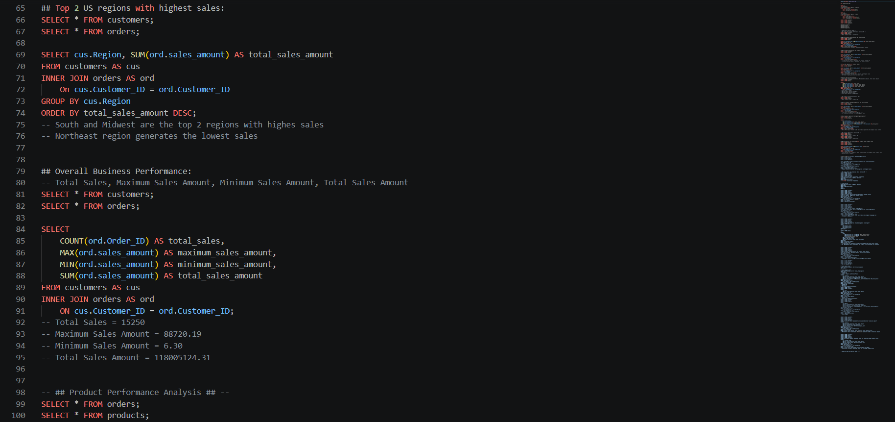

# Supply Chain Management & Financial Impact Analysis — SQL Project

An SQL project analyzing a multi-table supply chain dataset across sales performance, product profitability, supplier evaluation, delivery efficiency, and shipping cost impact. All analysis was performed in MySQL using a structured 4-table relational database covering 100,000+ order records.  

---

## Project Overview

Supply chain data rarely lives in one place, it's spread across orders, customers, products, and suppliers. This project simulates how a data analyst would connect those tables, ask real business questions, and surface actionable findings across four distinct analysis areas: sales, product performance, supplier performance, and financial impact.

Every query in this project is annotated with its business question and the finding it produced — making the SQL file readable as both code and analysis documentation.

---

## Analysis Snippet

---

## KPI Summary

| KPI | Value |
|-----|-------|
| Total Sales Amount | $118,005,124 |
| Total Shipping Cost | $5,854,836 |
| Total Orders | 15,250 |
| Maximum Single Sale | $88,720.19 |
| Minimum Single Sale | $6.30 |
| Top Product (Gross Profit) | Multi-Pack Impact Wrench - 1089 lb |
| Top Category (Gross Profit) | Packaging |
| Top City (Sales) | Atlanta |
| Top Region (Gross Profit) | South Region |
| Top Supplier (Sales) | Midwest Manufacturing Co. |

---

## Database Structure

| Table | Records | Description |
|-------|---------|-------------|
| `orders` | 100,000 | Order transactions, sales amounts, shipping costs, delivery status |
| `customers` | 5,000 | Customer type, industry, region, city |
| `products` | 2,000 | Product name, category, unit cost, unit price |
| `suppliers` | 250 | Supplier name, linked to products via Supplier_ID |

**Table Relationships:**
- `customers` → `orders` via `Customer_ID`
- `products` → `orders` via `Product_ID`
- `suppliers` → `products` via `Supplier_ID`

---

## Analysis Sections & Key Findings

### 1. Sales & Customer Performance Analysis

| Business Question | Finding |
|------------------|---------|
| Which customer types generate the most revenue? | Institutional customers generate the most revenue |
| Which industries generate the highest revenue? | Automotive is highest; Construction is lowest |
| Top 2 US regions by sales? | South and Midwest lead; Northeast is lowest |
| Overall business performance? | 15,250 total sales; $118M total revenue |

---

### 2. Product Performance Analysis

| Business Question | Finding |
|------------------|---------|
| Top 3 product categories by revenue? | Cleaning & Facility, Packaging, Tools |
| Which product generates the highest gross profit? | Multi-Pack Impact Wrench - 1089 lb |

---

### 3. Supplier Performance Analysis

| Business Question | Finding |
|------------------|---------|
| Supplier with highest total product cost? | Titan Systems Inc. ($7,969.99) |
| Supplier whose products generate highest sales? | Midwest Manufacturing Co. |

---

### 4. Supply Chain & Financial Impact Analysis

| Business Question | Finding |
|------------------|---------|
| Most frequent delivery status? | On Time |
| Region with most delayed deliveries? | Identified via WHERE + GROUP BY |
| Product with highest shipping cost? | Multi-Pack Impact Wrench - 1089 lb ($168,180.31) |
| Which shipping category needs investigation? | Low Shipping Cost — highest order count but lowest total sales |
| Which product category has highest sales? | Cleaning & Facility |
| Which products need financial investigation? | Electrical products |
| Which customer segment has high sales + high shipping? | Institutional customers |

---

## SQL Concepts & Functions Used

| Concept / Function | Purpose |
|--------------------|---------|
| `CREATE DATABASE` / `USE` | Database setup |
| `ALTER TABLE` / `MODIFY` | Data type normalization |
| `DESCRIBE` | Schema inspection |
| `SELECT` / `FROM` / `WHERE` | Core data retrieval |
| `INNER JOIN` (2-table) | Connecting customers ↔ orders, orders ↔ products |
| `INNER JOIN` (3-table) | Connecting suppliers → products → orders |
| `GROUP BY` / `ORDER BY` | Aggregation and sorting |
| `SUM()` / `COUNT()` / `MAX()` / `MIN()` / `AVG()` | Aggregate functions |
| `CASE WHEN` | Shipping cost categorization |
| `AS` (aliasing) | Table and column aliases |
| `LIMIT` / `OFFSET` | Result limiting |
| Gross Profit Calculation | `SUM(sales_amount) - SUM(quantity × unit_cost)` |

---

## Recommendations

Based on the analysis findings:

1. **Investigate Multi-Pack Impact Wrench shipping cost** — it generates the highest gross profit but also the highest shipping cost ($168,180), which could be significantly eroding margin

2. **Review the Northeast region's gross profit** — it is the lowest performing region despite not being the lowest in raw sales, suggesting a cost or margin issue worth investigating

3. **Investigate Construction and Food Service industries** — both are the lowest sales-generating industries across the entire customer base and may benefit from targeted sales or pricing strategy review

---

## Analysis Files in This Repository

| File | Description |
|------|-------------|
| `analysis_file.sql` | Full SQL script — database setup, data type normalization, and all analysis queries with inline findings |
| `report.pdf` | Written summary report covering KPIs, key findings, data structure, and recommendations |
| `sql_analysis_snippet.png` | Screenshot of the SQL analysis in MySQL Workbench |

---

## Key Learnings

- How to structure a multi-table relational database and normalize data types before any analysis begins
- Writing 2-table and 3-table INNER JOINs to answer questions that span multiple data sources
- Using `CASE WHEN` to create dynamic categorical groupings from continuous numeric data (shipping cost buckets)
- Calculating gross profit at both product and category level by combining sales and cost data across joined tables
- Annotating SQL with business questions and findings so the script doubles as readable analysis documentation — not just raw code
- Translating query results into actionable recommendations rather than just reporting numbers

---

## Author

**Md. Sirajul Islam**
- [linkedin.com/in/md-sirajul-islam57](https://linkedin.com/in/md-sirajul-islam57)
- [github.com/sirajul-islam5](https://github.com/sirajul-islam5)

---

## License

This project is open source and available under the [MIT License](LICENSE).

---

> *This is a self-driven project created for learning and portfolio purposes.*
